# ZPO Project - Pool Detection Model

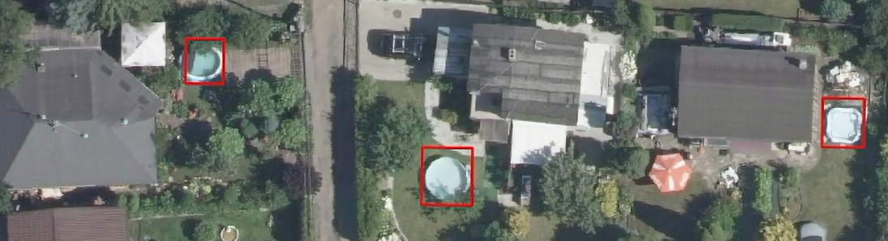

## Dataset
- Data Source: Satellite images of Poznan 2023 
- Number of Images: 6382 images total:
  - Train: 4467 images (70%),
  - Validation: 1277 images (20%),
  - Test: 638 images (10%)
- Number of Annotations:
  - free standing pool: 420,
  - pernament_pool: 36,
  - pond: 18
- Annotation Format: YOLO format (.txt files with [class, x_center, y_center, width, height]).
- Images at 10 cm/px resolution were cut into 511×511 px tiles, with ~10% overlap to avoid losing objects near tile edges.
- Link to the dataset with annotations: [LINK_HERE](https://app.roboflow.com/poolsearch2024/pool_searching)
- Folder structure:

      dataset/
      ├─ train/
      │    ├─ images/
      │    └─ labels/
      ├─ valid/
      │    ├─ images/
      │    └─ labels/
      └─ test/
       ├─ images/
       └─ labels/

- Configuration: The file data.yaml points to the train/validation/test subsets and class names
- Loading: The YOLO (ultralytics) library automatically loads images and labels from data.yaml.

## Training
- Model: YOLOv11 with pretrained weights: yolo11n.pt (n - small version)
- Training parameters:
  - epochs=50,
  - imgsz (image size)=512,
  - batch=16,
- Augmentation parameters used in training:
  - degrees: 10.0 (±10° rotation),
  - translate: 0.1 (up to 10% translation),
  - scale: 0.5 (scaling range from 50% to 150%),
  - shear: 2.0 (shearing up to ±2°),
  - flipud: 0.5 (vertical flip),
  - fliplr: 0.5 (horizontal flip) 
- The script to run the training: train.py
- Python version: 3.10, requirements list with versions in requirements.txt

## Results
- Example images from dataset:
<table>
  <tr>
    <td>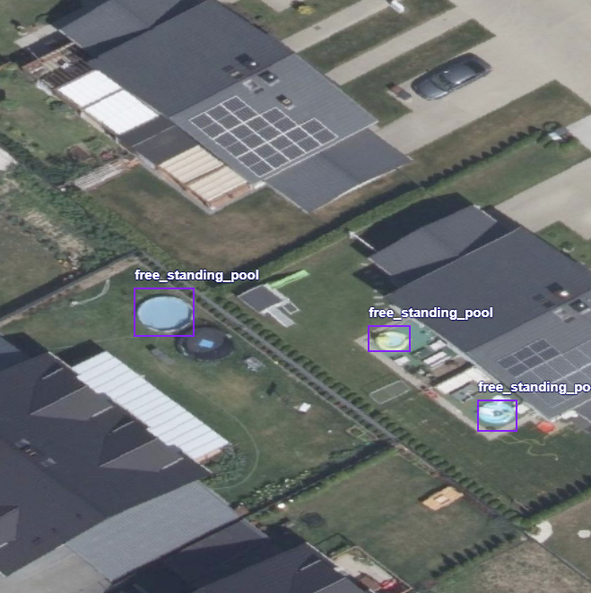</td>
    <td>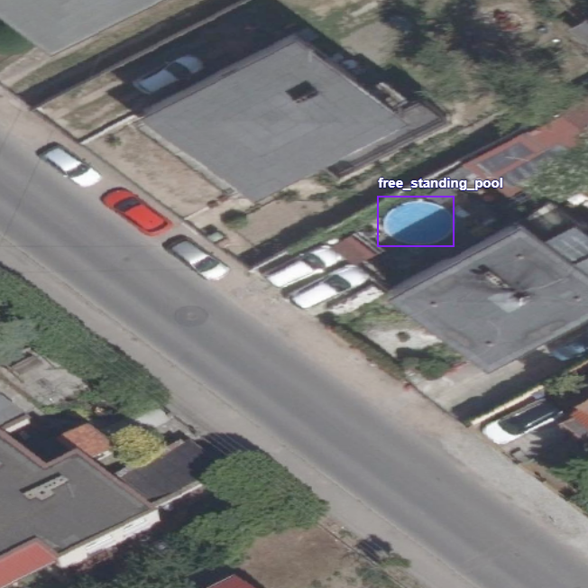</td>
  </tr>
  <tr>
    <td>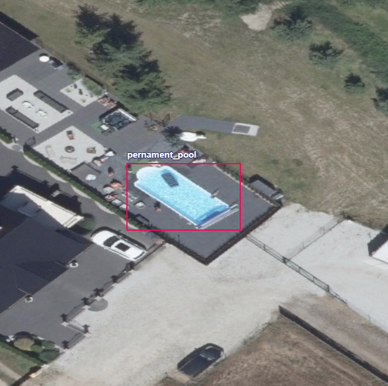</td>
    <td>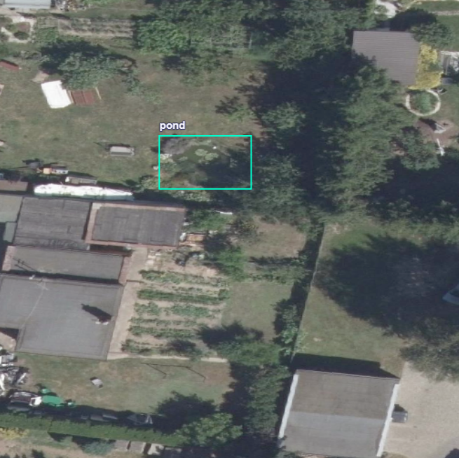</td>
  </tr>
</table>
- Examples of good and bad predictions:
<table>
  <tr>
    <td>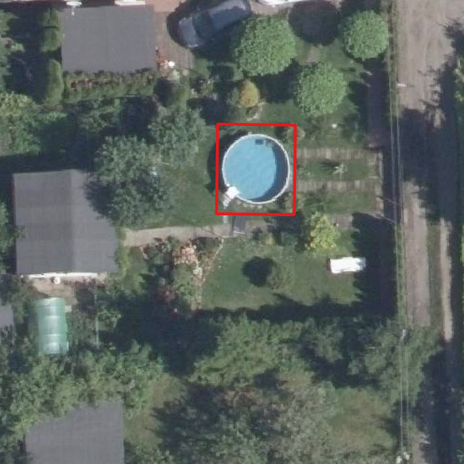</td>
    <td>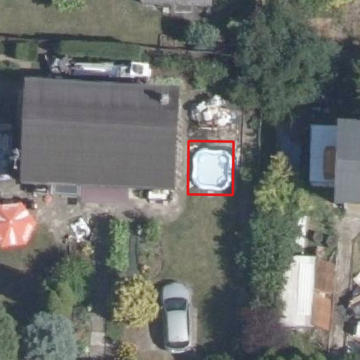</td>
  </tr>
  <tr>
    <td>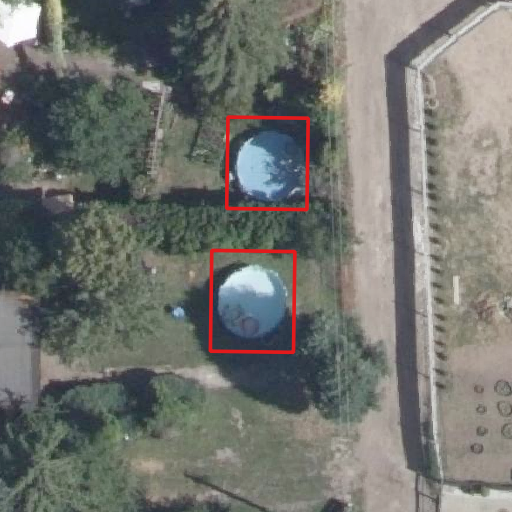</td>
    <td>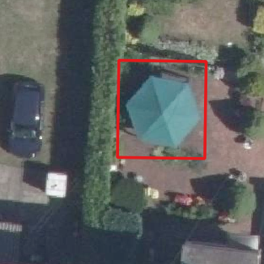</td>
  </tr>
</table>

- Metrics on the test and train dataset
  - Train:
    
  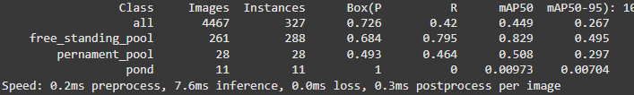
  - Test:
    
  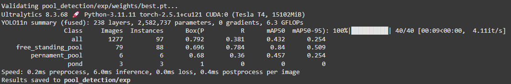

## Trained model in ONNX ready for `Deepness` plugin
- Model is available in the `model` directory
- After training, the model is converted automatically to ONNX format but needs to have appropriate metadata added to it. In order to do it, run script `add_metadata.py`, modyifing parameters if needed.

## Demo instructions and video

Example was shown on map "Poznan 2023 aerial ortophoto high resolution", available in QMS Plugin.
## People
- Jakub Junkiert - Annotations & Training Scripts - [GitHub](https://github.com/JJayU)
- Maksymilian Klemenczak - Annotations & Training Scripts - [GitHub](https://github.com/MaksymilianKlemen)
- Hubert Górecki - Annotations - [GitHub](https://github.com/theHaUBe)
- Jarosław Kuźma - Annotations - [GitHub](https://github.com/Yerbiff)

